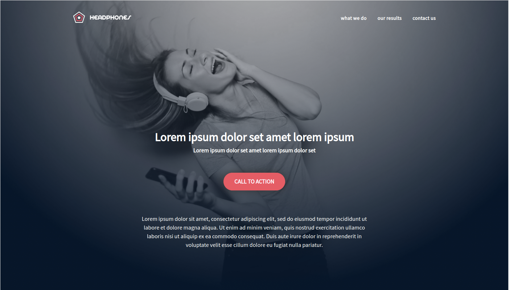
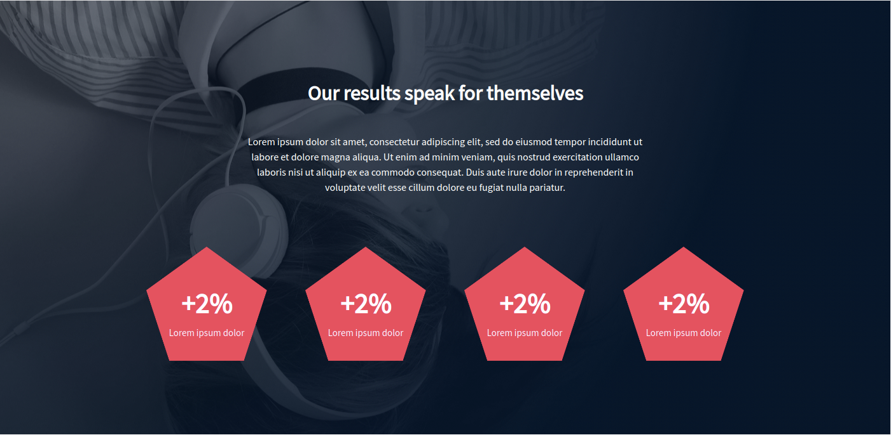
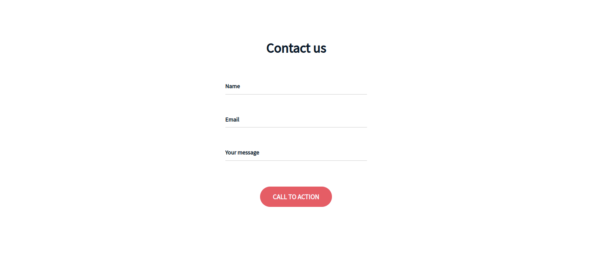
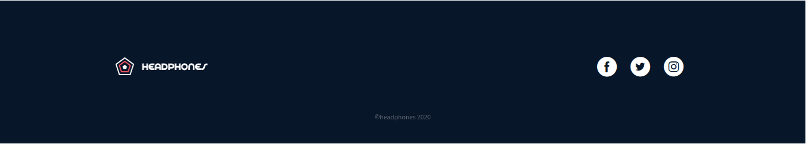
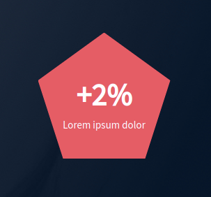
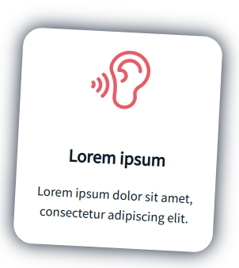
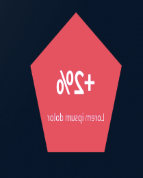

# 0x09. Implement a design from scratch

<p align="center">

</p>


## Context

Hi everyone ! In this project, I will implement from scratch, without any library, a web page. I will use all HTML/CSS/Accessibility/Responsive design knowledges that I learned previously.

## Purpose of this project 🎯

I won’t have a lot of instruction, I am free to implement it the way that I want - the objective is simple: Have a fully functional web page that looks the same as the designer file.

## Expected result 👀


*Designed by [Nicolas Philippot](https://www.linkedin.com/in/nic0fil/), UX/UI designer.*

## Requirements ⚠️

- I am not allowed to import external CSS framework (like Bootstrap)
- I am not allowed to use Javascript

## Project steps with result 📝
### 1. Create the header/hero piece
<p align="center">

</p>

### 2. Create the "What we do..." section
<p align="center">

</p>

### 3. Create the "Our results" section
<p align="center">

</p>

### 4. Create the contact form
<p align="center">

</p>

### 5. Create the footer
<p align="center">

</p>

### 6. Draw each pentagone using HTML and CSS

<p align="center">

</p>

### 7. Add fun animations to “What we do…” and “Our results” sections items row
<p align="center">


</p>

### 8. Create the SASS version of `101-styles.css`

## Tools 🛠️

| VS Code | Figma | Chrome DevTools | Sass | HTML5 | CSS3 |
|:---:|:---:|:---:|:---:|:---:|:---:|
|  |  |  |  |  |  |

## Cloning the repo ➡️

To clone this repository, you can run this command:
```
git clone git@github.com:rmarcais/holbertonschool-headphones.git
```

## Author 🖊️

| Rémi Marçais |
|:---:|
| <a href="https://www.linkedin.com/in/r%C3%A9mi-mar%C3%A7ais-274a4421a/">  <a href="https://github.com/rmarcais">  |
